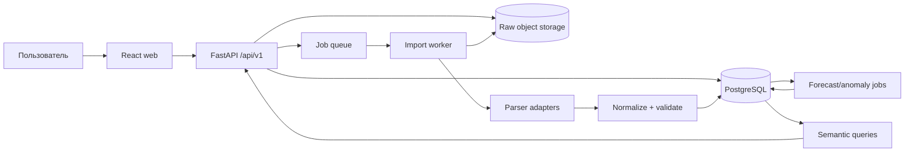

# ЭнергоПульс — implementation plan MVP

Статус: в реализации. Выполненные действия по ходу работы помечаются как `done`.
Текущий внешний блокер: в workspace отсутствуют реальные клиентские raw-файлы `.xlsx/.xls`, поэтому фактический импорт клиентского набора ещё не выполнен.

Дата аудита: 2026-07-27.

## 1. Решение

Текущий React/Vite-прототип можно сохранить как визуальную основу, но демонстрационные данные, mock-auth и монолитный `src/main.jsx` нужно заменить реальным API и разделёнными экранами.

Приложенный ETL-скрипт нельзя переносить в production как есть. Его полезно использовать как описание структуры файлов, но вычисления должны быть переписаны и покрыты проверяемыми правилами:

- хранить исходный файл неизменным;
- разбирать `.xlsx` и `.xls` адаптерами по структуре, а не по имени файла;
- сохранять исходное значение, нормализованное значение и координату ячейки;
- независимо пересчитывать расход из показаний и коэффициента;
- не доверять cached result формул Excel;
- не исправлять подозрительные значения молча;
- публиковать данные только после валидации и подтверждения импорта;
- хранить групповой небаланс один раз, а не копировать его в каждую строку счётчика.

Рекомендуемый стек MVP:

- frontend: существующий React/Vite, миграция на TypeScript, React Router, query-cache для API;
- backend: Python + FastAPI;
- database: PostgreSQL;
- ORM/migrations: SQLAlchemy + Alembic;
- background processing: отдельный worker и очередь задач; импорт не выполняется внутри HTTP-запроса;
- raw files: S3-compatible object storage; локальный volume/MinIO в development;
- forecast/data analysis: Python, модели с обязательным backtest;
- local environment: Docker Compose.

Python выбран потому, что основной риск проекта находится в Excel ingestion, нормализации, валидации и прогнозировании, а не в CRUD. Frontend и backend связываются OpenAPI-контрактом и сгенерированным TypeScript-клиентом.

## 2. Что проверено

### 2.1. Источники

| Набор | Состав | Наблюдение |
|---|---:|---|
| Ежедневные сводки | 3 `.xlsx`, 90 листов-дней | январь–март 2026 |
| Технический баланс | 1 `.xlsx` + 2 `.xls` | январь–март 2026 |
| Результат `Данные.xlsx` | `daily`: 6 660 строк; `monthly`: 1 236 строк | преобразован дополнительно относительно приложенного скрипта |
| Повторный запуск текущего скрипта | `daily`: 6 660; `monthly`: 1 368 строк | месячный результат расходится на 132 строки |

### 2.2. Подтверждённые дефекты

1. Скрипт открывает `.xlsx` с `data_only=True` и получает последнее cached value формулы Excel. Он не пересчитывает формулу сам.
2. Текстовые показания с запятой приводят к завышению расхода в 1000 раз в cached result исходных книг. Примеры:
   - скважина 141, январь: `32 578 020` вместо `32 578,02 кВт·ч`;
   - скважина 148, февраль: `27 193 200` вместо `27 193,2 кВт·ч`;
   - аналогичные ошибки присутствуют в феврале и марте.
3. В месячном результате текущего скрипта:
   - 10 ненумерических расходов;
   - 11 расхождений между сохранённым расходом и независимым расчётом;
   - 307 строк входят в повторяющиеся business keys;
   - часть повторного блока технического баланса извлекается второй раз.
4. В ежедневных данных есть 4 отрицательных расхода. На 2026-02-15 пустое следующее показание было фактически воспринято формулой Excel как ноль и дало `−11 064 789,4 кВт·ч`.
5. В `Данные.xlsx` четыре текстовых ошибки `#VALUE!` в колонке финансов: `O190`, `O402:O404`.
6. `Данные.xlsx` не содержит воспроизводимых формул: тариф и финансы сохранены как значения/текст.
7. Небаланс строки `Итого` размножается на каждую строку группы. Любая последующая сумма небаланса становится завышенной.
8. Месячный ETL теряет секцию/подстанцию, хотя парсер её находит.
9. `derive_object_name()` возвращает константу, но результат нигде не сохраняется.
10. `Тип потребителя` всегда равен `UNCLASSIFIED`; в итоговом Excel колонка удалена.
11. Год и месяц при ошибке имени файла молча подменяются на январь 2026.
12. Идентификаторы счётчиков после промежуточного CSV/Excel могут стать числами и потерять ведущие нули.
13. Строки без счётчика, расчётные потери, ручные оценки и физические показания смешаны в одном факте без признака метода расчёта.

Вывод: совпадение 6 660 ежедневных строк не означает корректность набора. Row count — только одна из проверок.

## 3. Канонические правила расчёта

### 3.1. Расход

Для накопительного счётчика:

```text
consumption_kwh = (next_reading - current_reading) × coefficient
```

Расчёт выполняется сервером через `Decimal`, а не `float`.

Правила исключений:

- если одного из показаний или коэффициента нет — расход не вычислять, создать validation issue;
- пустое показание никогда не заменять нулём;
- отрицательный delta не обнулять автоматически: это может быть ошибка, обратный поток, rollover или замена счётчика;
- rollover считать только при заданном `rollover_max`;
- замену счётчика оформлять отдельным событием и разрывать интервал;
- ручной/расчётный расход хранить с `calculation_method = estimated | calculated`, исходной формулой/основанием и отдельным quality status;
- исходный расход из Excel хранить для аудита, но основным становится независимо рассчитанное значение;
- допустимое отклонение сравнения задаётся конфигурацией, стартово `max(0,01 кВт·ч; 0,01%)`.

### 3.2. Тариф

Тариф `59,87 тг/кВт·ч` хранится в таблице `tariffs` с датой начала/окончания действия. Он не должен быть magic number в коде или Excel.

Формула KPI:

```text
amount_kzt =
  ROUND(
    SUM(accepted_consumption_kwh within one approved billing boundary)
    × effective_tariff_kzt_per_kwh,
    2
  )
```

Дополнительные условия:

- `source_kind = technical_balance`;
- `quality_status = accepted`;
- `billable = true`;
- одна утверждённая граница учёта, чтобы один и тот же поток не суммировался на вводе, подстанции и конечном счётчике одновременно.

Фраза «умножить только данные с техбаланса» недостаточна для корректной суммы: техбаланс содержит несколько уровней одной энергетической цепочки. Применение тарифа ко всем 1 236 строкам `monthly` даёт около `12,409 млрд тг`, но эта сумма недостоверна из-за повторного учёта и ошибок ×1000. До согласования `billable/balance role` финансовый KPI должен помечаться как «не подтверждён», а не публиковаться как официальный.

Правило округления нужно зафиксировать с заказчиком: рекомендуемый вариант — сначала агрегировать кВт·ч на утверждённой границе, затем умножать и округлять итог до тиынов.

### 3.3. Небаланс

Небаланс является фактом группы/границы, а не атрибутом каждого счётчика:

```text
imbalance_kwh = inflow_kwh - outflow_kwh - approved_losses_kwh
imbalance_pct = imbalance_kwh / inflow_kwh × 100
```

Точный знак, состав `outflow` и учёт нормативных потерь должны быть подтверждены заказчиком. При `inflow = 0` процент не рассчитывается.

## 4. Границы MVP

### Входит

- реальная авторизация и роли `admin`, `operator`, `viewer`;
- загрузка известных клиентских форматов `.xlsx` и `.xls`;
- журнал импортов со статусом и неизменяемым исходным файлом;
- автоматическое определение `daily_summary` / `technical_balance` по structure fingerprint;
- preview, validation report, карантин и явная публикация;
- справочник станций, подстанций, объектов, скважин и счётчиков;
- ручное сопоставление неизвестных объектов при импорте;
- effective-dated тариф;
- три дэшборда: ежемесячный, ежедневный, аномалии;
- фильтры: станция, подстанция, период;
- прогноз на 1–30 апреля 2026 с версией модели и backtest-метриками;
- детерминированный insight-текст;
- экспорт таблиц/ошибок;
- audit log;
- Docker Compose, миграции, CI и резервное копирование БД.

### Не входит в первый MVP

- поддержка произвольного Excel без заранее известной структуры;
- LLM-ассистент по данным;
- почасовой дэшборд при отсутствии почасового источника;
- автоматическое исправление сомнительных значений без подтверждения;
- сложный тарифный конструктор с зонами суток, налогами и договорными исключениями;
- автоматическое обучение ML-моделей без контроля качества и backtest.

## 5. Архитектура



Импорт и публикация разделяются:

```text
uploaded → queued → parsing → validating → needs_review
         → ready_to_publish → publishing → published
         ↘ rejected / failed
```

Только `published`-версия участвует в дэшбордах. Повторная загрузка с тем же checksum идемпотентна и не удваивает факты.

## 6. Структура репозитория

Целевая структура:

```text
apps/
  web/                 # текущий Vite/React после декомпозиции
  api/                 # FastAPI routes, services, auth
  worker/              # ingestion, forecast, anomaly jobs
packages/
  web-api-client/      # generated TypeScript client from OpenAPI
infra/
  docker/
  compose.yaml
docs/
  MVP_IMPLEMENTATION_PLAN.md
  data-contract.md
  metric-dictionary.md
tests/
  fixtures/            # только обезличенные/minimal golden fixtures
```

Клиентские книги не коммитить в Git. В тестовые fixtures вынести минимальные обезличенные строки, воспроизводящие найденные дефекты.

## 7. Модель данных

### Справочники

| Таблица | Назначение |
|---|---|
| `organizations` | владелец данных/tenant, даже если в MVP он один |
| `sites` | объект/месторождение |
| `stations` | станция |
| `substations` | подстанция, принадлежит станции |
| `assets` | иерархия объектов: well, feeder, input, consumer, loss node, external org |
| `meters` | номер как `text`, тип, коэффициент, transformer ratio, период активности |
| `asset_meter_links` | история привязки счётчика к объекту |
| `tariffs` | ставка, валюта, единица, effective dates |
| `balance_boundaries` | утверждённые входы/выходы и billing scope |

### Импорт и lineage

| Таблица | Назначение |
|---|---|
| `import_batches` | статус, тип набора, период, пользователь, checksum, статистика |
| `import_files` | storage key, оригинальное имя, MIME/signature, размер |
| `staging_rows` | raw JSON, sheet, row, parser version |
| `validation_issues` | rule code, severity, cell/range, raw value, recommendation, resolution |
| `mapping_candidates` | неизвестные/неоднозначные объекты и решение пользователя |
| `audit_events` | кто загрузил, сопоставил, подтвердил и опубликовал |

### Факты

| Таблица | Grain |
|---|---|
| `meter_readings` | счётчик × интервал, current/next readings |
| `consumption_facts` | asset/meter × день или месяц × source kind |
| `balance_facts` | boundary × день/месяц; inflow, outflow, losses, imbalance |
| `anomalies` | rule/model × fact/asset × interval |
| `forecast_runs` | модель, training cutoff, horizon, backtest metrics |
| `forecast_points` | run × дата × asset/boundary |

Обязательные поля `consumption_facts`:

- `source_kind`: `daily_summary | technical_balance`;
- `granularity`: `day | month`;
- `calculation_method`: `meter_delta | source_formula | calculated | estimated | manual_override`;
- `raw_consumption_kwh`;
- `normalized_consumption_kwh`;
- `quality_status`;
- `flow_role`: `inflow | outflow | internal | loss | consumer`;
- `billable`;
- `import_batch_id`, `source_sheet`, `source_row`;
- `superseded_by`/publication version.

Показания, коэффициенты, кВт·ч, тариф и деньги хранятся в PostgreSQL `numeric`, не в floating-point типах.

## 8. Ingestion pipeline

1. **Upload**
   - проверка расширения и file signature;
   - лимит размера и защита от zip bomb;
   - SHA-256;
   - сохранение raw file;
   - `202 Accepted` и `import_batch_id`.
2. **Detect**
   - листы `DD.MM` + ожидаемые заголовки → daily adapter;
   - листы/заголовки техбаланса → monthly adapter;
   - несовпадение → `unsupported_schema`, без fallback на январь 2026.
3. **Extract**
   - для `.xlsx` читать формулу и cached value отдельно;
   - для `.xls` использовать отдельный adapter;
   - сохранять cell type, raw/display value, sheet и row;
   - не использовать pandas type inference для идентификаторов.
4. **Normalize**
   - trim/whitespace/неразрывные пробелы;
   - decimal comma → `Decimal`;
   - meter number всегда text;
   - дата листа валидируется с годом файла;
   - нормализация названий не уничтожает исходную строку.
5. **Map**
   - точное соответствие по meter number;
   - затем alias table;
   - regex-классификация только как candidate;
   - неоднозначность требует решения пользователя.
6. **Validate**
   - schema, type, required fields;
   - formula recomputation;
   - continuity между соседними периодами;
   - duplicate/business key;
   - missing/negative/rollover;
   - выброс ×1000;
   - hierarchy/balance reconciliation;
   - daily sum против monthly technical balance — как проверка, не объединение фактов.
7. **Review**
   - статистика accepted/warning/error;
   - preview строк;
   - mapping UI;
   - downloadable issue report.
8. **Publish**
   - одна транзакция;
   - предыдущая версия периода superseded, но не удалена;
   - пересчёт materialized aggregates;
   - постановка anomaly/forecast jobs.

Severity:

- `error`: блокирует публикацию строки или всего batch;
- `warning`: публикуется только после подтверждения;
- `info`: нормализация без потери смысла.

## 9. API v1

### Import

- `POST /api/v1/imports`
- `GET /api/v1/imports`
- `GET /api/v1/imports/{id}`
- `GET /api/v1/imports/{id}/issues`
- `GET /api/v1/imports/{id}/preview`
- `POST /api/v1/imports/{id}/mappings`
- `POST /api/v1/imports/{id}/publish`
- `POST /api/v1/imports/{id}/reject`

### Dashboards

- `GET /api/v1/dashboards/monthly`
- `GET /api/v1/dashboards/daily`
- `GET /api/v1/dashboards/anomalies`
- `GET /api/v1/filters`
- `GET /api/v1/forecasts?target_month=2026-04`

Общие query parameters:

- `station_id`;
- `substation_id`;
- `date_from`;
- `date_to`;
- `asset_type`;
- `page`, `page_size`, `sort`.

Ответ каждого dashboard endpoint возвращает согласованный snapshot:

- `meta`: filters, data version, last published batch, quality flags;
- `kpis`;
- `series`;
- `breakdowns`;
- `table`;
- `insight`;
- `warnings`.

Это предотвращает ситуацию, когда карточки и графики рассчитаны по разным версиям данных.

### Administration

- CRUD справочников и aliases;
- CRUD/effective dates тарифа;
- anomaly resolution;
- users/roles;
- audit log.

## 10. Дэшборды

### 10.1. Ежемесячное потребление

Источник: опубликованный `technical_balance`, grain `month`.

Компоненты:

- сумма расхода на выбранной утверждённой границе;
- сумма в тенге по effective tariff;
- расход по скважинам;
- расход по счётчикам;
- таблица объектов;
- quality warning, если часть строк исключена;
- drill-down `station → substation → asset → meter`.

Таблица объектов:

- объект, тип, станция, подстанция;
- расход;
- доля в текущем scope;
- предыдущий месяц и delta;
- тарифная сумма только для `billable`;
- качество/аномалии;
- lineage до файла, листа и строки.

### 10.2. Ежедневное потребление

Источник: опубликованный `daily_summary`, grain `day`.

Компоненты:

- сумма расхода;
- расход по скважинам;
- расход по подстанциям;
- расход по счётчикам;
- таблица потребления;
- actual 2026-01-01…2026-03-31 + forecast 2026-04-01…2026-04-30;
- prediction interval;
- insight-текст;
- отметки дней с неполными/исключёнными данными.

### 10.3. Аномалии

Компоненты:

- сравнение `current_reading` и `next_reading`;
- расход по дням, скважинам, месяцам и подстанциям;
- небаланс по утверждённой boundary;
- список событий с severity/status;
- фильтр `all/new/in_review/resolved/accepted_exception`;
- переход к исходной строке импорта.

Стартовый набор правил:

- `MISSING_READING`;
- `NEGATIVE_DELTA`;
- `FORMULA_MISMATCH`;
- `DECIMAL_SCALE_X1000`;
- `READING_DISCONTINUITY`;
- `DUPLICATE_FACT`;
- `UNKNOWN_MAPPING`;
- `SPIKE_ROBUST_BASELINE`;
- `IMBALANCE_THRESHOLD`;
- `DAILY_MONTHLY_RECONCILIATION`.

Data-quality anomaly и operational anomaly отображаются раздельно.

## 11. Прогноз апреля 2026

Доступно только 90 дней истории, поэтому сложная ML-модель не является автоматическим улучшением.

Порядок:

1. исключить rejected data и отдельно маркировать confirmed exceptions;
2. построить baseline:
   - seasonal naive по дню недели;
   - rolling median/weekday;
   - ETS/Holt-Winters только при достаточном количестве наблюдений;
3. сделать rolling-origin backtest на феврале/марте;
4. выбрать модель по MAE и WAPE; MAPE не использовать как основной metric при нулевых расходах;
5. построить 30 точек 2026-04-01…2026-04-30;
6. сохранить model version, training cutoff `2026-03-31`, метрики и interval;
7. агрегировать только по совместимому уровню, без двойного учёта.

Insight для MVP формируется детерминированно:

- ожидаемый расход апреля и изменение к марту;
- ожидаемый peak day;
- топ-3 contributors;
- количество критичных data-quality flags;
- краткое ограничение прогноза.

LLM для текста можно добавить после стабилизации метрик.

## 12. Frontend migration

Существующие части переиспользуются:

- shell, sidebar, topbar;
- theme tokens/light-dark;
- `Card`, `KpiCard`, chart styles;
- anomaly status визуальный язык;
- таблицы и drill-down pattern.

Новая структура:

```text
src/
  app/
  pages/
    MonthlyDashboard/
    DailyDashboard/
    AnomalyDashboard/
    Imports/
    Admin/
  components/
  api/
  hooks/
  types/
  utils/
```

Текущие экраны объединяются:

- `Overview + Consumption` → Monthly dashboard;
- `Consumption + Forecast` → Daily dashboard;
- `Anomalies + Reconciliation` → Anomaly dashboard;
- `Quality` → Imports/data quality;
- `Peaks` откладывается до появления почасовых данных.

UI requirements:

- URL сохраняет фильтры;
- loading/empty/error/partial-data states;
- server-side pagination;
- cancel устаревших запросов;
- единицы `кВт·ч/МВт·ч` форматируются, но API всегда возвращает базовую единицу;
- никакие KPI не заменяются нулём при ошибке API;
- показывать `data_version` и последнее обновление.

## 13. Тестирование и контроль качества

### ETL golden tests

Обязательные fixtures:

- decimal comma;
- meter ID `000250`;
- blank next reading;
- formula `#VALUE!`;
- завышение ×1000;
- ручной расход при неизменных показаниях;
- отрицательный delta;
- `.xls` и `.xlsx`;
- повторный месячный блок;
- групповой небаланс;
- повторная загрузка того же файла.

### Backend

- unit tests расчётов и parser adapters;
- migration tests;
- integration tests API + PostgreSQL;
- worker retry/idempotency;
- authorization matrix;
- upload security tests;
- snapshot tests dashboard DTO;
- query plan/index checks на реальном объёме.

### Frontend

- component tests для фильтров и metric states;
- API contract tests;
- E2E: upload → review → publish → dashboards;
- visual regression трёх dashboard pages;
- accessibility smoke tests.

### Data acceptance

Перед UAT формируется утверждённый golden dataset с:

- точным числом accepted/rejected rows;
- контрольными расходами по 10–20 счётчикам;
- контрольными итогами по каждому уровню;
- контрольным небалансом;
- контрольной тарифной суммой;
- списком ожидаемых anomalies.

## 14. Этапы реализации

Оценка ниже — ориентир для команды из двух инженеров (frontend + backend/data) при участии аналитика заказчика и part-time QA.

### Этап 0 — metric contract и golden data, 3–5 рабочих дней

- [ ] подтвердить иерархию;
- [ ] определить station/substation mappings;
- [ ] утвердить flow roles и billable boundary;
- [ ] утвердить тарифные даты и округление;
- [ ] утвердить метод небаланса;
- [ ] разобрать 11 formula mismatches и ручные значения;
- [ ] подготовить golden dataset.

Критерий: заказчик подписал `metric-dictionary.md` и контрольные суммы.

### Этап 1 — foundation, 3–5 дней

- [x] целевая структура репозитория;
- [x] TypeScript frontend baseline;
- [x] FastAPI skeleton;
- [x] PostgreSQL + object storage + Redis + worker в локальном Docker Compose baseline;
- [x] migrations (Alembic) baseline: инициализирован `alembic/`, настроен `env.py` на `app.config`, создан и проверен `initial_schema` migration;
- [ ] полноценная queue/worker orchestration;
- [ ] CI: lint, tests, build;
- [x] Docker Compose;
- [x] environment/secrets policy.

Критерий: один command поднимает web/api/worker/db/storage; health checks зелёные.

### Этап 2 — data model, auth и справочники, 5–7 дней

- [x] schema из раздела 7 для import/data foundation (`import_batches`, `import_files`, `staging_rows`, `validation_issues`);
- [ ] users/roles;
- [ ] station/substation/assets/meters/tariffs;
- [ ] aliases и mappings;
- [ ] audit log;
- [ ] seed approved tariff `59,87` с согласованной датой.

Критерий: миграции воспроизводимы; CRUD и role matrix покрыты тестами.

### Этап 3 — ingestion и validation, 8–12 дней

- [x] upload/status endpoints;
- [x] immutable raw storage;
- [x] baseline adapters for `.csv`, `.xlsx`, `.xls`;
- [x] normalization через `Decimal`;
- [x] validation rules skeleton;
- [x] import preview/issues;
- [x] transactional publish baseline;
- [x] idempotency/versioning;
- [x] export validation report.

Критерий: все 6 клиентских файлов проходят pipeline; ни одна строка не исчезает без recorded reason; ошибки ×1000 и blank-reading выявляются автоматически.

### Этап 4 — semantic layer и API дэшбордов, 6–8 дней

- [ ] approved metric queries;
- [ ] tariff calculation;
- [ ] balance facts;
- [x] filters (baseline): query params `station_id/substation_id/date_from/date_to` добавлены в `monthly/daily/anomalies/energy-business`; добавлен `GET /api/v1/filters`; вынесен общий helper period-range filtering для консистентного поведения;
- [x] monthly/daily/anomaly DTO (baseline): в `meta.filters` возвращаются применённые фильтры для синхронизации URL/UI и API snapshot;
- [ ] indexes/materialized aggregates при необходимости;
- [ ] reconciliation tests.

Критерий: API totals совпадают с golden dataset при любом сочетании фильтров.

### Этап 5 — anomaly и forecast, 5–8 дней

- [ ] rule engine;
- [ ] anomaly workflow;
- [ ] forecast baselines/backtest;
- [ ] April 2026 run;
- [ ] deterministic insight;
- [ ] сохранение model/run metadata.

Критерий: найденные дефекты из аудита воспроизводятся как anomalies; forecast не использует данные позже 2026-03-31.

### Этап 6 — frontend MVP, 8–12 дней

- [ ] декомпозиция `src/main.jsx`;
- [ ] real auth;
- [ ] import wizard;
- [ ] 3 dashboard pages;
- [ ] фильтры и URL state;
- [ ] tables/drill-down/export;
- [ ] quality states;
- [ ] generated API client.

Критерий: полный E2E upload → publish → filter → drill-down работает без mock data.

### Этап 7 — hardening, UAT и release, 5–7 дней

- [ ] нагрузочный smoke test;
- [ ] backup/restore drill;
- [ ] security checklist;
- [ ] observability/logging;
- [ ] UAT fixes;
- [ ] runbook и user guide;
- [ ] production deployment.

Критерий: UAT sign-off, restore проверен, release rollback задокументирован.

Ориентир: 43–64 инженерных дня, обычно 7–10 календарных недель с учётом согласований. Этапы 1–2 можно вести параллельно с завершением golden data, но официальные KPI и тарифный итог блокируются этапом 0.

## 15. Блокирующие решения заказчика

1. Что именно является `станцией`, а что `подстанцией` в приложенных книгах?
2. Какие строки техбаланса образуют единственную тарифную границу и имеют `billable = true`?
3. С какой даты действует `59,87 тг/кВт·ч`; включает ли тариф НДС?
4. Округление выполняется на строке, объекте или после общей месячной агрегации?
5. Как трактовать ручные значения `50 000` и `100 кВт·ч` при неизменных показаниях?
6. Допустимы ли отрицательные расходы/обратный поток; где задан rollover?
7. Формула и знак небаланса, перечень нормативных потерь, threshold.
8. Следует ли включать «Сторонние организации» в операционные KPI, тариф и прогноз?
9. Нужна ли корректировка опубликованного периода через новую версию или только новый импорт?
10. Прогноз апреля 2026 должен оставаться исторической зафиксированной версией или при новых данных пересчитываться?

## 16. Первая поставка

Первый вертикальный slice должен быть небольшим, но сквозным:

1. загрузить одну ежедневную `.xlsx` и один месячный `.xls`;
2. показать статус, raw lineage и ошибки;
3. корректно обработать decimal comma, leading-zero ID и blank reading;
4. сопоставить station/substation/meter;
5. опубликовать batch;
6. вернуть один monthly KPI, один daily series и anomaly list;
7. отобразить их в существующей визуальной оболочке.

После этого расширять поддержку остальных листов и виджетов. Такой slice рано проверяет все главные риски: Excel, mapping, формулы, очередь, БД, API и UI.

## 17. Технические основания

- FastAPI рекомендует выносить тяжёлые фоновые вычисления из процесса HTTP API в отдельную очередь/worker: <https://fastapi.tiangolo.com/tutorial/background-tasks/>.
- `openpyxl data_only=True` возвращает последнее сохранённое значение формулы, а не вычисляет её: <https://openpyxl.readthedocs.io/en/stable/tutorial.html#loading-from-a-file>.
- PostgreSQL `numeric` — exact numeric selectable precision: <https://www.postgresql.org/docs/current/datatype.htm>.
- SQLAlchemy `Numeric` по умолчанию возвращает Python `Decimal`: <https://docs.sqlalchemy.org/en/20/core/type_basics.html#sqlalchemy.types.Numeric>.
